# Step-By-Step Guide to Set Up Python Development Environment in Visual Studio Code using LSEG Data Library

## Introduction

**Disclosure**: This article is AI generated content with my reviewed and revised. The AI is [GitHub Copilot](https://github.com/features/copilot) with *Claude Sonnet 4.5* agent.

The Data Library is latest evolution of library that provides a set of ease-of-use interfaces offering coders uniform access to the breadth and depth of LSEG financial data and services. The [Data Library for Python](https://developers.lseg.com/en/api-catalog/lseg-data-platform/lseg-data-library-for-python) provides a set of ease-of-use interfaces offering coders uniform access to the breadth and depth of financial data and services available on the Workspace, RDP, and Real-Time Platforms via the Python programming language. The API is designed to provide consistent access through multiple access channels and target both Professional Developers and Financial Coders. Developers can choose to access content from the desktop, through their deployed streaming services, or directly to the cloud. With the Data Library, the same Python code can be used to retrieve data regardless of which access point you choose to connect to the platform.

This article is a sequel to my [Step-By-Step Guide to install Data Library for Python using Virtual Environment](https://developers.lseg.com/en/article-catalog/article/step-by-step-guide-install-data-library-python-virtual-env) article ([GitHub](https://github.com/LSEG-API-Samples/Example.DataLibrary.Python.InstallationGuide)). This sequel provides a step-by-step guide to set up a Python development environment in [Visual Studio Code](https://code.visualstudio.com/) (VS Code) using the Data Library for Python as an example API. VS Code is a popular, free, and open-source code editor that provides excellent support for Python development through extensions, integrated terminal, debugging capabilities, and more. I strongly recommend you read this article together with the [library Quick Start page](https://developers.lseg.com/en/api-catalog/lseg-data-platform/lseg-data-library-for-python/quick-start) to cover all basic knowledge that you need to use the library.

Please note that even through the article aims for the LSEG Data Library for Python application development, the steps can be applied to other Python libraries with VS Code too.

## Prerequisite 

### Python 

You need the [Python](https://www.python.org/) programming language installed on your machine.

This article is based on Python version 3.12.

### Visual Studio Code

You need [Visual Studio Code](https://code.visualstudio.com/) installed on your machine. You can download it from the [official website](https://code.visualstudio.com/download).

This article is based on VS Code version January 2026 (update version 1.109.3).

### Access to Python Package Repository

You need an access to Python Package Repository. The public repositories are [PyPI](https://pypi.org/), [Anaconda](https://anaconda.org/anaconda/repo), and [Conda-forge](https://anaconda.org/conda-forge/repo).

Some organization might deployed the Data Library for Python and other packages in their internal repository (example: LSEG), so you need to configure the Python and the Package Manager to connect to your internal repository. 

Please contact your local IT support to help you access your company internal repo. 

I am demonstrating with the [Python venv](https://docs.python.org/3/library/venv.html) and [PyPI](https://pypi.org/) repository in this article. If you are using Conda, please see the steps on the [first article]() for more detail.

## The Basic Rule

Please let me remind you again, ***do not install the Data Library for Python in the based or global Python installation***.

The reason is to avoid dependencies conflict between libraries requirements such as the following example.

```bash
A module that was compiled using NumPy 1.x cannot be run in
NumPy 2.0.2 as it may crash. To support both 1.x and 2.x
versions of NumPy, modules must be compiled with NumPy 2.0.
Some module may need to rebuild instead e.g. with 'pybind11>=2.12'.
 
If you are a user of the module, the easiest solution will be to
downgrade to 'numpy<2' or try to upgrade the affected module.
We expect that some modules will need time to support NumPy 2.
 
Traceback (most recent call last):  File "c:\python\LDP_Library\LDP_Library\Examples\tempCodeRunnerFile.py", line 3, in <module>
    import pandas as pd
```

This error message means the Python already has the NumPy library version 1.x (from other projects) installed. However, the Data Library for Python requires NumPy version 2 (**as of version 2.1.1**) which both version cannot be installed together.

We can handle this dependencies conflict issue with a  **Python virtual environment**. A Python virtual environment is an isolated directory containing its own Python interpreter and a set of installed packages. This isolation prevents conflicts between dependencies of different Python projects and ensures project reproducibility.

VS Code has excellent support for Python virtual environments through the Python extension. This article demonstrates how to set up and use Python virtual environments with VS Code using [venv](https://docs.python.org/3/library/venv.html).

It is recommend that **you create and use one virtual environment per one Python project**.

## Setting Up VS Code for Python Development

### Step 1: Install the Python Extension

Open Visual Studio Code and navigate to the Extensions view by clicking the Extensions icon in the Activity Bar on the side of the window or by pressing `Ctrl+Shift+X` (Windows/Linux) or `Cmd+Shift+X` (Mac).

Search for **[Python](https://marketplace.visualstudio.com/items?itemName=ms-python.python)** in the Extensions marketplace and install the official Python extension published by Microsoft.

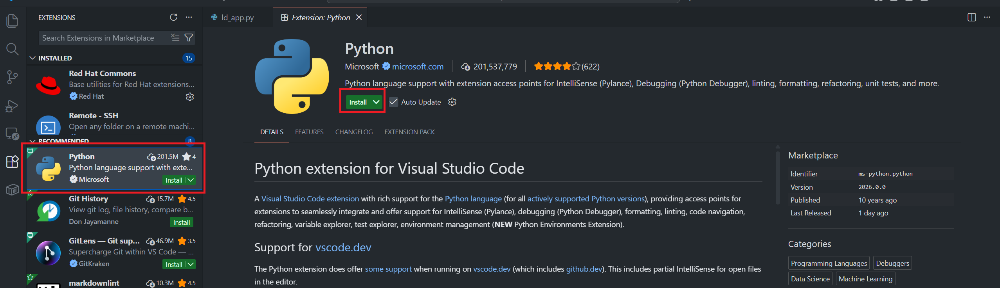

This extension provides:
- IntelliSense (code completion)
- Linting
- Debugging
- Code formatting
- Unit testing support
- Python environment management

### Step 2: Verify Python Installation

After installing the Python extension, you see the list of extensions that bundled with the Python extension as follows:

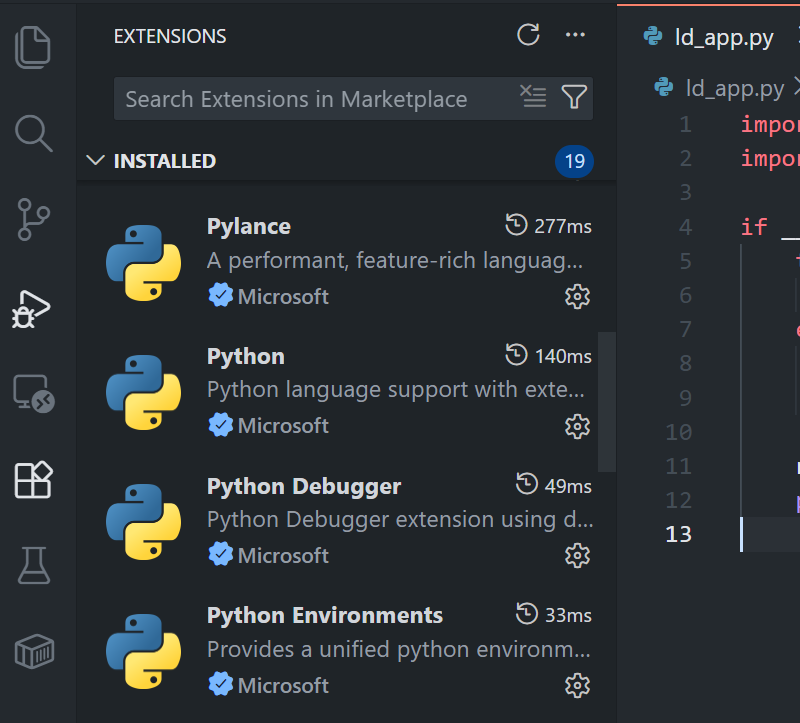

you can verify your Python installation by opening the Command Palette (`Ctrl+Shift+P` or `Cmd+Shift+P`) and typing "Python: Select Interpreter".

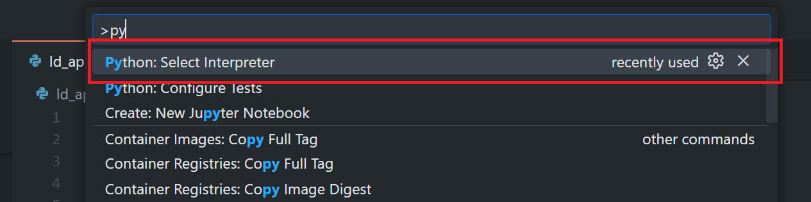

You should see a list of available Python interpreters installed on your system.

You can find more detail on the [Python in Visual Studio Code](https://code.visualstudio.com/docs/languages/python) official document page.

### Step 3: Install the Jupyter Notebook Extensions

Next, open VS Code Extensions panel and search for **[Jupyter](https://marketplace.visualstudio.com/items?itemName=ms-toolsai.jupyter)* to install Jupyter Notebook extensions.

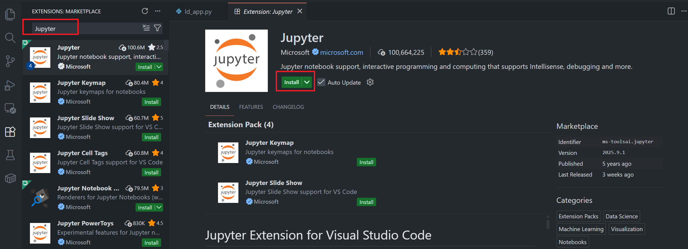
Jupyter
After installing the Jupyter extension, you see the list of extensions that bundled with the Jupyter extension as follows:

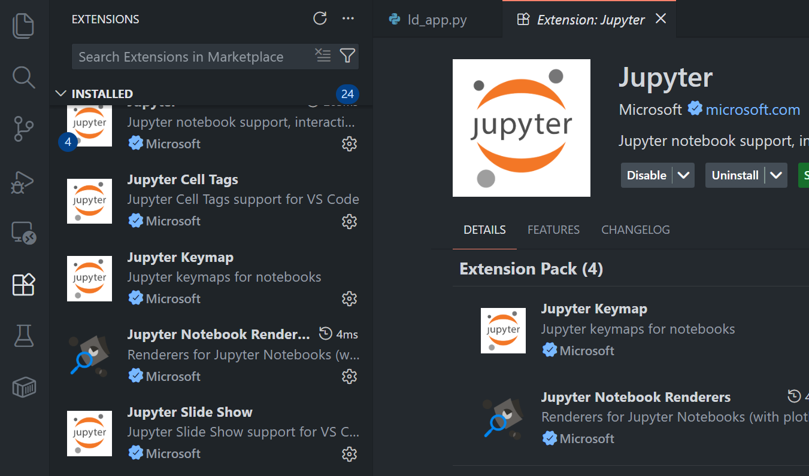

you can verify your Jupyter extension installation by creating any **.ipynb** file and see if it shows a notebook application like this.

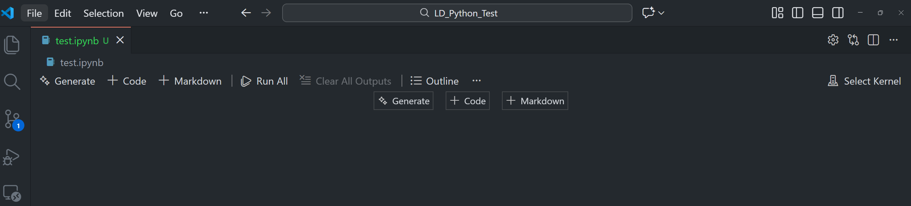

## Setting Up Python Virtual Environment with venv in VS Code

I am demonstrating the Data Library for Python on VS Code setupp using the venv. The [Python venv](https://docs.python.org/3/library/venv.html) is a Python built-in module that lets developers create and manage Python virtual environment. The venv lets developers manage and install Python packages from [PyPI](https://pypi.org/) with a [pip tool](https://packaging.python.org/en/latest/tutorials/installing-packages/).

With the venv, a virtual environment always uses the same Python version as the based version.

### Step 1: Create a Virtual Environment

Open a project folder in VS Code and then, open the integrated terminal in VS Code (**Ctrl+`** or **View > Terminal**) and run the following command to create a virtual environment:

```bash
python -m venv ld
```

This creates a new virtual environment in a folder named *ld* within your project directory.

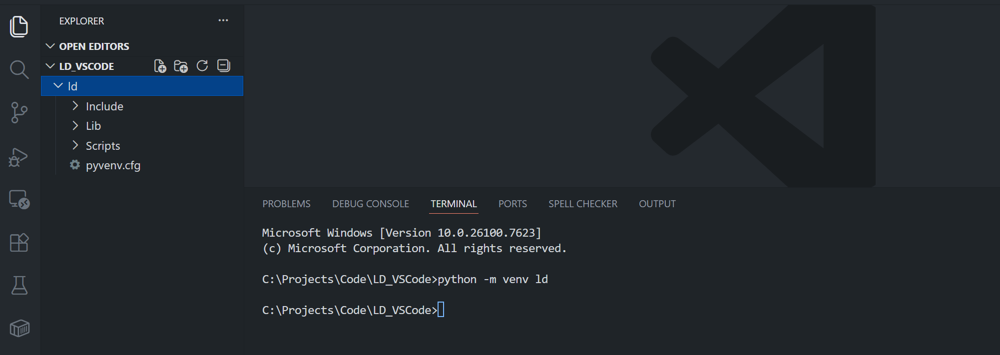

**Note**: You can name your virtual environment anything you like. Some developers prefer **.venv_name** (with a dot prefix) to keep it hidden on Unix-like systems.

### Step 2: Select the Virtual Environment in VS Code

After creating the virtual environment, VS Code may automatically detect it and prompt you to select it. If not, you can manually select it:

1. Open the Command Palette (`Ctrl+Shift+P` or `Cmd+Shift+P`)
2. Type "Python: Select Interpreter"
3. Select the *ld* virtual environment

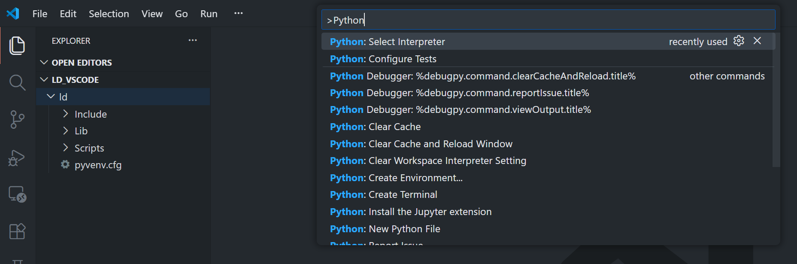

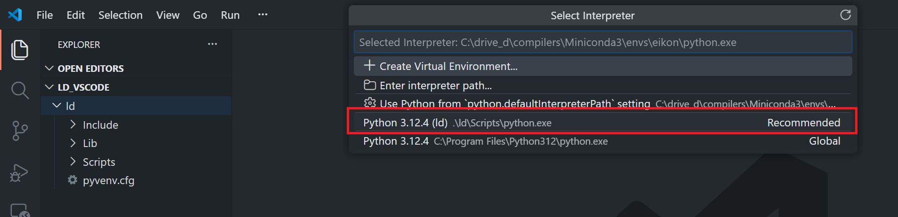

The selected interpreter will be displayed in the status bar at the bottom of VS Code when you open the Python file.

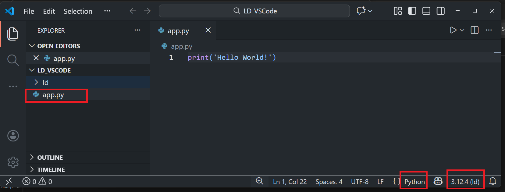


### Step 3: Activate the Virtual Environment

VS Code automatically activates the selected virtual environment when you open a new terminal. However, if you need to manually activate it:

**Windows:**
```bash
ld\Scripts\activate
```

**Linux and MacOS:**
```bash
source ld/bin/activate
```

You should see the virtual environment name in parentheses at the beginning of your terminal prompt.

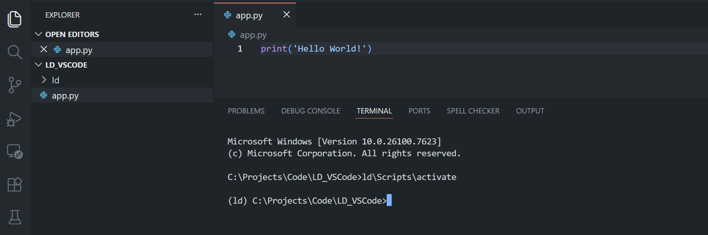

### Step 4: Install the Data Library for Python

**Note**: If your organization uses internal repository to store Python packages, please contact your local IT support to help you configure the pip system to access that repository first.

Now install the Data Library for Python with the following command in the VS Code terminal:

```bash
pip install lseg-data
```

You can install multiple packages at the same time:

```bash
pip install lseg-data jupyterlab matplotlib pandas
```

**Note**: In some environment behind proxy, you might need the following command instead.

```bash
pip install --trusted-host pypi.python.org --trusted-host files.pythonhosted.org --trusted-host pypi.org --no-cache-dir lseg-data
```

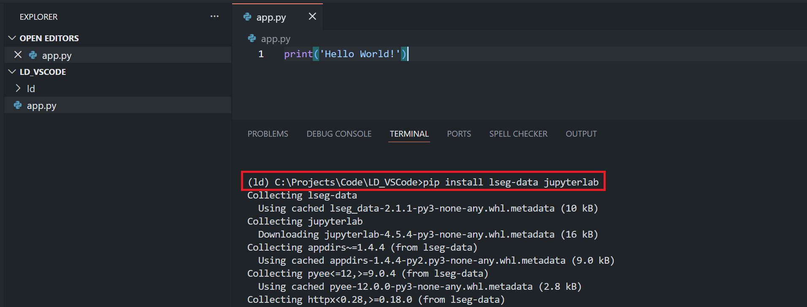

### Step 5: Verify the Installation

Create a new Python file in VS Code (**File > New File** or **Ctrl+N**) and save it with a **.py** extension. Add the following code to verify the installation:

```python
import lseg.data as ld

print(f"LSEG Data Library version: {ld.__version__}")
```

Run the file by clicking the "Run Python File" button in the top-right corner of the editor, or by pressing **Ctrl+F5** and choose.

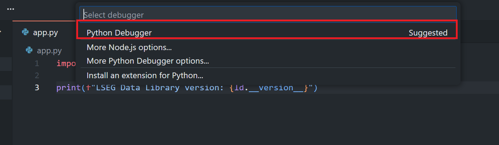

You should see the Data Library version printed in the terminal output.

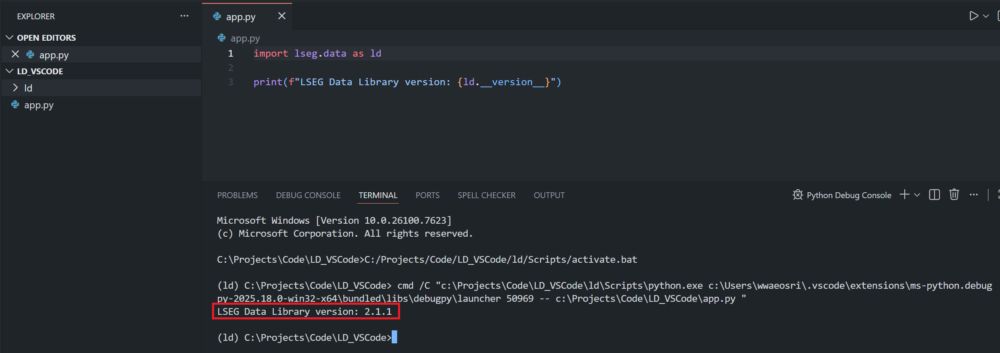

### Step 6: Create a Requirements File

To track your project dependencies, create a `requirements.txt` file. In the VS Code terminal, run:

```bash
pip freeze > requirements.txt
```

This creates a file listing all installed packages and their versions. You can view this file in VS Code:

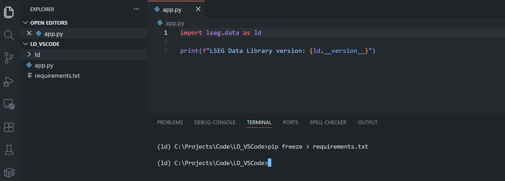

To install dependencies from this file in the future, use:

```bash
pip install -r requirements.txt
```

### Step 7: Working with Python Files in VS Code

VS Code provides excellent features for Python development:

**IntelliSense and Code Completion**: As you type, VS Code provides intelligent code completion suggestions.

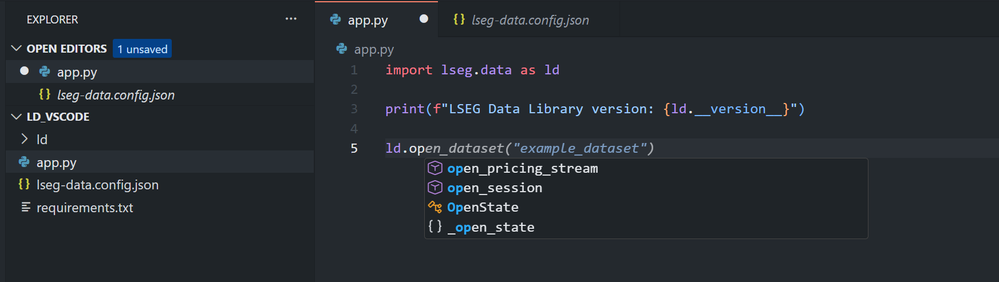

**Debugging**: Set breakpoints by clicking in the left margin of the editor, then press `F5` to start debugging.

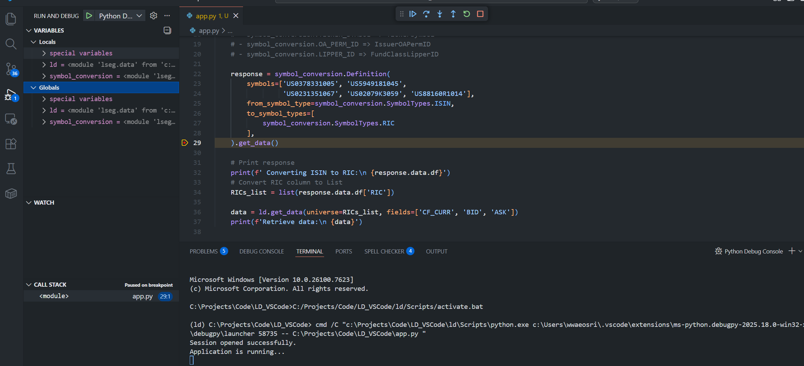

If you interested in Linting and code formatting, you can follow instructions on the [Linting Python in Visual Studio Code](https://code.visualstudio.com/docs/python/linting) and [Formatting Python in VS Code](https://code.visualstudio.com/docs/python/formatting) pages.

Recommended Exertions
- [Microsoft Pylint](https://marketplace.visualstudio.com/items?itemName=ms-python.pylint) extension
- [Microsoft autopep8](https://marketplace.visualstudio.com/items?itemName=ms-python.autopep8) extension

## Setting Up Python Virtual Environment with Anaconda in VS Code

Please check my [Step-By-Step Guide to install Data Library for Python using Virtual Environment](https://developers.lseg.com/en/article-catalog/article/step-by-step-guide-install-data-library-python-virtual-env) article ([GitHub](https://github.com/LSEG-API-Samples/Example.DataLibrary.Python.InstallationGuide)) about how to create a Conda environment. The VS Code Python and Jupyter Extensions can recognize the Conda environment as Python environment for working too.

## Working with Jupyter Notebooks in VS Code

VS Code has excellent support for Jupyter Notebooks, allowing you to work with `.ipynb` files directly in the editor.

### Step 1: Create a New Notebook

1. Open the Command Palette (`Ctrl+Shift+P`), and type  "Create: New Jupyter Notebook". Alternatively, you may create a file with *.ipynb* extension manually.
2. Save the newly created *.ipynb* file to the name that you prefer (I am using *notebook.ipynb* name).

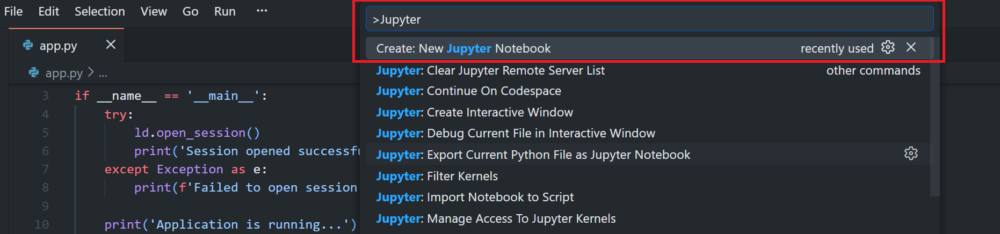

3. Select your virtual environment as the kernel by clicking on the "Select Kernel" button.

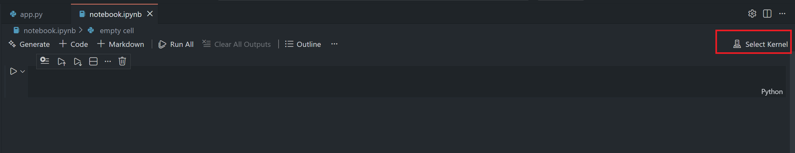

4. Then choose, "Python Environments" (If you already have existing Jupyter Server, you can choose this option, but it is out of scope of this article)


5. Choose an environment with [Jupyterlab](https://jupyter.org/install) installation.

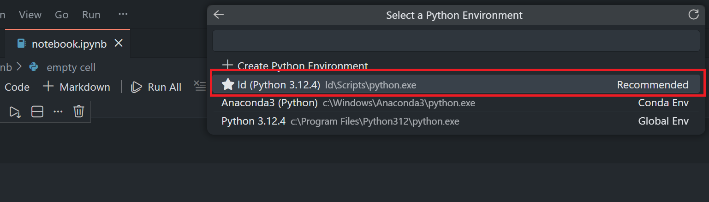

6. You see that the selected environment named is shown on the notebook kernel button.

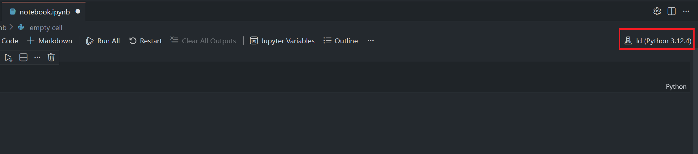


### Step 3: Use the Data Library in a Notebook

Create new code cells and import the Data Library:

```python
import lseg.data as ld
import pandas as pd

# Open a session
ld.open_session()

# Example: Get data
df = ld.get_data(
    universe=['AAPL.O', 'MSFT.O', 'GOOGL.O'],
    fields=['TR.PriceClose', 'TR.Volume']
)

print(df)

# Close the session
ld.close_session()
```

Run the cell by clicking the play button or pressing `Shift+Enter`.

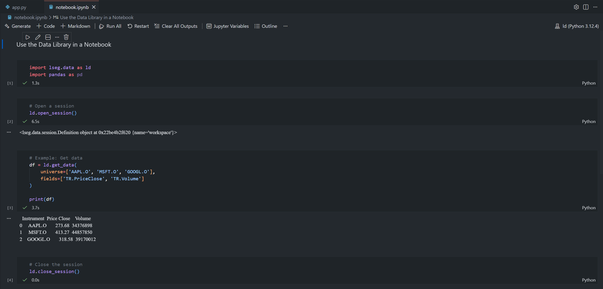

VS Code's Jupyter integration provides:
- Interactive cell execution
- Rich output display (charts, tables, images)
- Variable explorer
- IntelliSense and code completion
- Debugging support

ํWith the Jupyter Notebook, you can create markdown cells for documentation and code cells for the code.


Please see more detail about how to use the Jupyter Notebooks in VS Code via the [VS Code official document](https://code.visualstudio.com/docs/datascience/jupyter-notebooks) page.

## Managing Multiple Python Environments in VS Code

VS Code makes it easy to work with multiple Python projects, each with their own virtual environment:

### Workspace Settings

You can configure Python settings per workspace by creating a `.vscode/settings.json` file in your project folder:

```json
{
    "python.defaultInterpreterPath": "${workspaceFolder}/<prefer venv name>/Scripts/python.exe",
    "python.terminal.activateEnvironment": true,
    "[python]": {
        "editor.defaultFormatter": "ms-python.autopep8",
        "editor.formatOnSave": true
    }
}
```

This ensures VS Code always uses the correct environment for your project.

### Switching Between Environments

You can easily switch between different Python environments:

1. Click on the Python version in the status bar, or
2. Open Command Palette and select "Python: Select Interpreter"
3. Choose the environment you want to use

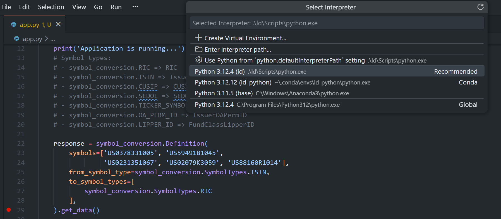

## Tips for Efficient Development in VS Code

### 1. Use Code Snippets

Create custom code snippets for common Data Library operations. Go to `File > Preferences > Configure Snippets` and select Python:

```json
{
    "Import Data Library": {
        "prefix": "ldimport",
        "body": [
            "import lseg.data as ld",
            "import pandas as pd",
            "",
            "ld.open_session()",
            "$0"
        ],
        "description": "Import and open LSEG Data Library session"
    }
}
```

### 2. Keyboard Shortcuts

Learn these useful keyboard shortcuts:
- **Ctrl+` ** - Toggle integrated terminal
- **Ctrl+Shift+P** - Command Palette
- **Ctrl+/** - Toggle line comment
- **Shift+Alt+F** - Format document
- **F5** - Start debugging
- **Ctrl+F5** - Run without debugging

### 3. Use Tasks for Common Commands

Create a `.vscode/tasks.json` file to define common tasks:

```json
{
    "version": "2.0.0",
    "options": {
        "shell": {
            "executable": "cmd.exe",
            "args": ["/d", "/c"]
        }
    },
    "tasks": [
        {
            "label": "Install Dependencies",
            "type": "shell",
            "command": "${workspaceFolder}\\<venv_name>\\Scripts\\activate.bat && pip install -r requirements.txt",
            "group": "build"
        },
        {
            "label": "Update Data Library",
            "type": "shell",
            "command": "${workspaceFolder}\\<venv_name>\\Scripts\\activate.bat && pip install --upgrade lseg-data",
            "group": "build"
        }
    ]
}
```

Run tasks via **Terminal > Run Task** command.

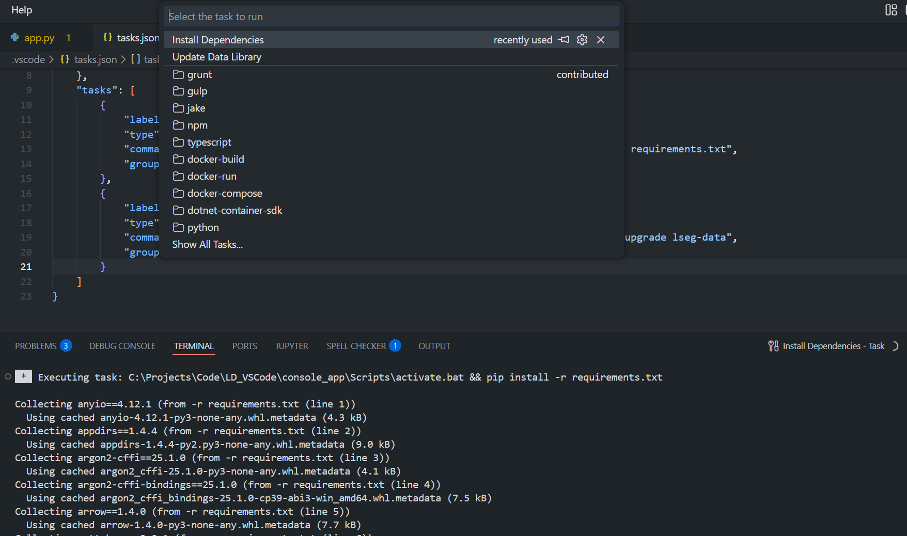

### 4. Configure Git Integration

Initialize a Git repository and create a `.gitignore` file to exclude virtual environment folders:

```
# Virtual Environment
venv/
.venv/
env/
ENV/

# Conda
.conda/

# VS Code
.vscode/

# Python
__pycache__/
*.py[cod]
*.so
.Python

# Jupyter Notebook
.ipynb_checkpoints

# Environment files
.env
```

## Troubleshooting

### Issue 1: VS Code Not Detecting Virtual Environments

**Solution**: 
- Reload the window: **Ctrl+Shift+P** > "Developer: Reload Window"
- Manually select the interpreter: **Ctrl+Shift+P** > "Python: Select Interpreter"
- Check that the virtual environment is created in your project folder

### Issue 2: Terminal Not Activating Virtual Environment

**Solution**:
- Check VS Code settings: **python.terminal.activateEnvironment** should be **true**
- On Windows, you may need to change the execution policy for PowerShell:
  ```powershell
  Set-ExecutionPolicy -ExecutionPolicy RemoteSigned -Scope CurrentUser
  ```

### Issue 3: Import Errors or Module Not Found

**Solution**:
- Verify the correct interpreter is selected (check status bar)
- Ensure packages are installed in the active environment:
  ```bash
  pip list
  ```
- Reload the window after installing packages

### Issue 4: IntelliSense Not Working

**Solution**:
- Install Pylance extension
- Reload the window
- Check Python language server settings: **Ctrl+,** > search for "Python Language Server"

### Issue 5: SSLCertVerificationError When Installing Packages

**Solution**:
```bash
pip install --trusted-host pypi.python.org --trusted-host files.pythonhosted.org --trusted-host pypi.org --no-cache-dir lseg-data
```

If this doesn't help, contact your local IT support.

## Best Practices

1. **One Environment Per Project**: Always create a dedicated virtual environment for each project
2. **Use Requirements Files**: Keep track of dependencies with *requirements.txt* or *environment.yml*
3. **Version Control**: Use Git and create a proper *.gitignore* file
4. **Code Formatting**: Configure and use code formatters like autopep8 or black
5. **Linting**: Enable linting to catch potential errors early
6. **Documentation**: Add docstrings to your functions and classes
7. **Testing**: Write unit tests for your code
8. **Regular Updates**: Keep your packages updated, especially security-related packages

## Conclusion

Visual Studio Code provides a powerful and flexible environment for developing with the LSEG Data Library for Python. By setting up proper virtual environments and leveraging VS Code's extensive Python support, you can create efficient and maintainable data analysis applications.

Key takeaways:
- Always use virtual environments to isolate project dependencies
- Take advantage of VS Code's Python extension features
- Use Jupyter Notebooks integration for interactive data exploration
- Configure your workspace settings for consistent development experience
- Utilize extensions and shortcuts to boost productivity

## <a id="references"></a>References

You can find more detail regarding the Data Library and VS Code from the following resources:

**Data Library Resources:**

- [LSEG Data Library for Python](https://developers.lseg.com/en/api-catalog/lseg-data-platform/lseg-data-library-for-python) on the [LSEG Developer Community](https://developers.lseg.com/) website
- [Data Library for Python - Reference Guide](https://developers.lseg.com/en/api-catalog/lseg-data-platform/lseg-data-library-for-python/documentation#reference-guide)
- [The Data Library for Python - Quick Reference Guide (Access layer)](https://developers.lseg.com/en/article-catalog/article/the-data-library-for-python-quick-reference-guide-access-layer) article
- [Essential Guide to the Data Libraries - Generations of Python library (EDAPI, RDP, RD, LD)](https://developers.lseg.com/en/article-catalog/article/essential-guide-to-the-data-libraries) article
- [Data Library for Python Examples on GitHub](https://github.com/LSEG-API-Samples/Example.DataLibrary.Python) repository
- [Step-By-Step Guide to install Data Library for Python using Virtual Environment](https://developers.lseg.com/en/article-catalog/article/step-by-step-guide-install-data-library-python-virtual-env) article.
- [Step-By-Step Guide to install Data Library for Python using Virtual Environment GitHub](https://github.com/LSEG-API-Samples/Example.DataLibrary.Python.InstallationGuide)

**VS Code Resources:**

- [Visual Studio Code - Python Tutorial](https://code.visualstudio.com/docs/python/python-tutorial)
- [VS Code - Python Environments](https://code.visualstudio.com/docs/python/environments)
- [VS Code - Jupyter Notebooks](https://code.visualstudio.com/docs/datascience/jupyter-notebooks)
- [Python in VS Code](https://code.visualstudio.com/docs/languages/python)

For any question related to this example or Data Library, please use the Developers Community [Q&A Forum](https://community.developers.refinitiv.com).
